# Model Car Warehouse Analysis

- The database used in project is `mintclassicsDB.sql` file. I prefered **MySQL Workbench** in this study. So, using the "Import from Self-Contained File" option from the Data Import tool, use the script to create the Mint Classic database on your MySQL Workbench platform.

- You can find SQL queries in the `sql` folder and queries result in the `csv` folder.

- ER Diagram of the db is below.

<br>

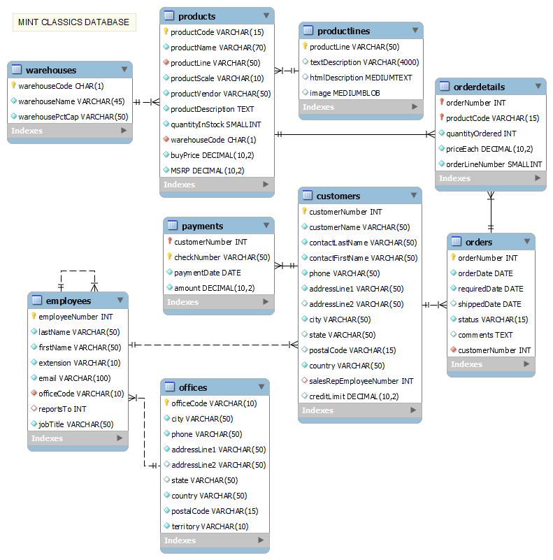

## First Look at the Project

### Project Scenario

**Mint Classics Company**, a retailer of classic model cars and other vehicles, is looking at closing one of their storage facilities. 

To support a data-based business decision, they are looking for suggestions and recommendations for reorganizing or reducing inventory, while still maintaining timely service to their customers. For example, they would like to be able to ship a product to a customer within 24 hours of the order being placed.

### Project Objectives

1. Explore products currently in inventory.

2. Determine important factors that may influence inventory reorganization/reduction.

3. Provide analytic insights and data-driven recommendations.

## SQL Queries to Understand Data and Make Some Conclusions

### 1st Query: 
- To see the relationship between warehouse name and stock availability, this SQL query will help. The figure shows that the largest warehouse is `East` and the smallest one is `South`. You can also see that storage percentage of these. In terms of availability `West` seems to be good.  On the other hand `North` and `South` are close to full.

```sql
SELECT 
    w.warehouseCode,
    w.warehouseName,
    COUNT(p.productCode) AS totalProducts,
    SUM(p.quantityInStock) AS totalQuantityInStock,
    w.warehousePctCap AS storagePercentage,
    FLOOR(SUM(p.quantityInStock) * (100 - w.warehousePctCap) / 100) AS stockAvailability
FROM 
    products p 
LEFT JOIN 
    warehouses w 
ON 
    w.warehouseCode = p.warehouseCode
GROUP BY
    w.warehouseCode, 
    w.warehouseName
ORDER BY
    totalQuantityInStock DESC
;
```

<br>

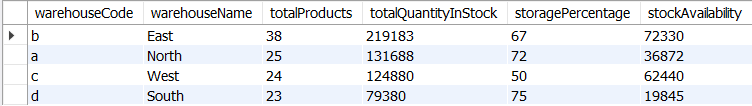
---
### 2nd Query:
- Using this query, I want to find out which warehouses contain which product types, and also how much of each they contain. To summarize: `East` contains only `Classic Cars` while `West` contains only `Vintage Cars`. `North` contains both `Motorcycles` and `Planes`. `South` has by itself three of all product types, namely `Trucks and Buses`, `Ships` and `Trains`.  

```sql
SELECT
    w.warehouseName,
    p.productLine,
    SUM(p.quantityInStock) AS totalStock
FROM
    products p
LEFT JOIN
    warehouses w
ON
    w.warehouseCode = p.warehouseCode
GROUP BY
    w.warehouseName,
    p.productLine
ORDER BY 
    totalStock DESC
;
```

<br>

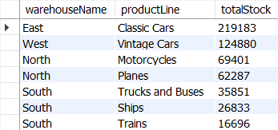
---
### 3rd Query:
- To find out which type of product is most popular in terms of total quantity ordered, I ran this query. As you can see `Classics Cars` is in first place and `Trains` in last place.


```sql
SELECT
    p.productLine,
    SUM(od.quantityOrdered) AS totalQuantityOrdered
FROM 
    orderdetails od
LEFT JOIN
    products p
ON 
    p.productCode = od.productCode
GROUP BY
    p.productLine
ORDER BY
    totalQuantityOrdered DESC
;
```

<br>

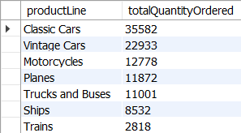
---
### 4th Query:
- Most of the orders come from `East`.

```sql
SELECT 
    w.warehouseCode,
    w.warehouseName, 
    COUNT(od.orderNumber) AS totalOrders, 
    SUM(od.quantityOrdered) AS totalQuantityOrdered
FROM 
    warehouses w
JOIN 
    products p 
ON 
    w.warehouseCode = p.warehouseCode
JOIN 
    orderdetails od 
ON 
    p.productCode = od.productCode
GROUP BY 
    w.warehouseCode, 
    w.warehouseName
ORDER BY 
    totalQuantityOrdered DESC;
```

<br>

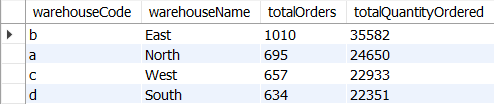
---
### 5th Query:
- To answer how many orders come from which country, this query will help us. The USA is by far in first place. The next countries are France, Spain and Australia.

```sql
SELECT 
    customers.country,
    COUNT(customers.country) AS totalOrder
FROM
    orders
LEFT JOIN
    customers
ON 
    customers.customerNumber = orders.customerNumber
GROUP BY
    customers.country
ORDER BY
    totalOrder DESC
;
```

<br>

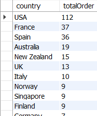 
---
### 6th Query:
- Here we can see the most popular product is `192 Ferrari 360 Spider red`, which is located in `East` warehouse.

```sql
SELECT 
    p.productName,
    p.productLine,
    p.warehouseCode,
    SUM(od.quantityOrdered) AS totalOrdered,
    p.quantityInStock
FROM 
    products p
LEFT JOIN 
    orderdetails od 
ON 
    p.productCode = od.productCode
GROUP BY 
    p.productCode, 
    p.productName
ORDER BY 
    totalOrdered DESC
;
```

<br>

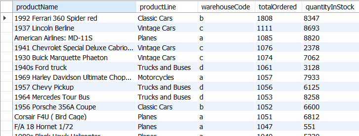
---
### 7th Query:
To answer how many customers live in which country, this query will help us. Customers who are living in USA are by far in first place. The next countries are Germany, France and Spain.

```sql
SELECT 
    country,
    COUNT(customerNumber) AS totalCustomer
FROM 
    customers
GROUP BY
    country
ORDER BY
    totalCustomer DESC
;
```

<br>

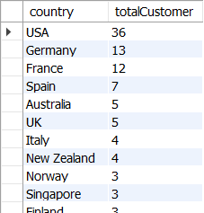
---
### 8th Query:
- I wondered that the difference between the order date and the shipping date, so I wrote this query. The result is devistating because some of the orders, not all, that come from Singapore has 65 days delay of shipping. If you look more closely you can see all of these belongs order number of 10165. You can check the full result in the folder of `csv`.

```sql
SELECT 
    o.orderNumber,
    o.orderDate,
    o.shippedDate,
    DATEDIFF(o.shippedDate, o.orderDate) AS dateDifference,
    p.productLine,
    w.warehouseName,
    c.country
FROM 
    orders o
LEFT JOIN 
    orderdetails od 
ON 
    od.orderNumber = o.orderNumber
LEFT JOIN
    products p
ON
    p.productCode = od.productCode
LEFT JOIN 
    warehouses w
ON
    w.warehouseCode = p.warehouseCode
LEFT JOIN
    customers c
ON	
    c.customerNumber = o.customerNumber
ORDER BY 
    dateDifference DESC
;
```

<br>

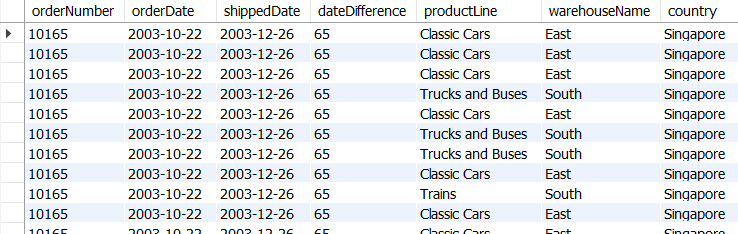
---
### 9th Query:
- Ninth query was made for seeing product shortage in terms of the number of total order and product's quantities in recent stock. Some of the products located in `North` are in first 4 rows.

```sql
SELECT 
    p.productName,
    p.productLine,
    p.warehouseCode,
    SUM(od.quantityOrdered) AS totalOrdered,
    p.quantityInStock
FROM 
    products p
LEFT JOIN 
    orderdetails od 
ON 
    p.productCode = od.productCode
GROUP BY 
    p.productCode, 
    p.productName
HAVING 
    totalOrdered > quantityInStock
ORDER BY 
    totalOrdered DESC
;
```

<br>

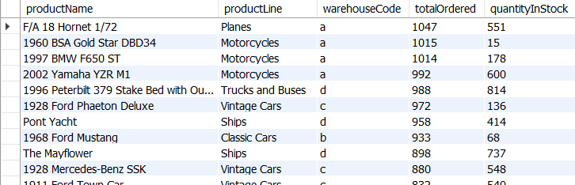   
---
### 10th Query:
- Finally, this query shows us that the amount of some products in the company's inventory are extremely high. These numbers should come down. For example, if you look at the `1995 Honda Civic` which has been ordered 917 times but it's quantity in stock is nearly 11 times higher than the number of it's orders.   


```sql
SELECT 
    p.productName,
    p.productLine,
    p.warehouseCode,
    SUM(od.quantityOrdered) AS totalOrdered,
    p.quantityInStock,
    ROUND((100 * p.quantityInStock) / SUM(od.quantityOrdered)) AS overStockPercentage
FROM 
    products p
LEFT JOIN 
    orderdetails od 
ON 
    p.productCode = od.productCode
GROUP BY 
    p.productName
ORDER BY 
    overStockPercentage DESC
;
```
<br>

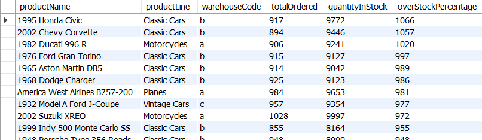

## Recommendations 
1. Warehouse Optimization:

- The `South` warehouse, with the smallest stock and highest capacity usage (75%), is a potential candidate for closure. Its inventory could be redistributed to the `East`, `North`, and `West` warehouses, which have higher capacity and/or better utilization.

- The `North` and `South` warehouses are nearly full, suggesting a need to either expand their capacity or redistribute stock more evenly.

2. Product Inventory Adjustments:

- Several high-demand products, such as `F/A 18 Hornet 1/72` and `1960 BSA Gold Star DBD34`, are understocked. Increasing their stock would help reduce the lead time between order and shipping.

- Some products, like the `1995 Honda Civic`, are significantly overstocked with inventories exceeding demand by more than 10x. These excesses tie up capital and storage unnecessarily. A targeted clearance or demand-forecasting adjustment is recommended.

3. Market Expansion:

- `Spain` and `Germany` are promising markets. `Spain` ranks third in total orders, and `Germany` ranks second in number of customers. Establishing new offices in these countries could support local customer engagement and increase market share.

4. Operational Efficiency:

- An unusually long delay (65 days) was identified in order `10165`. This should be investigated to identify process inefficiencies or supply chain disruptions.

5. Product Line Specialization:

- Warehouses currently hold specific product lines (e.g., `East`: `Classic Cars`, `West`: `Vintage Cars`). This specialization seems effective and could be further optimized for logistics and forecasting.
